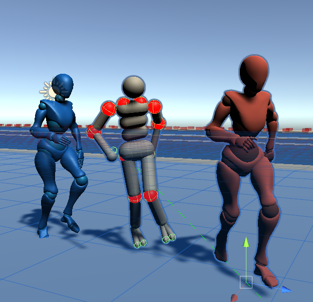

# README #

I have used this Repository to integrate the use of physics-based characters, as found in the project *Marathon Environments*, with usual character animation techniques, based on  skinned characters. This project is a fork of *Marathon Environments*, and the Readme of the initial project can be found [here](README-marathon-environments.md). Joe Booth is the main developer of   *Marathon Environment*, and has also helped substantially in this project.

**Problem:** After playing for a couple weeks with 2 or 3 different approaches to physics-based characters, based on  examples available in Unity, the best examples I get are always like if they came with this *department of silly walks* effect, which obviously does not appear in the demos of the papers. It is annoying, and we absolutely need to solve it if we want to have something that can be used in practice... 


 My main goal is to find out how this compares with typical character Animation techniques.  For this the main challenges is adapting the current system, based on Ragdolls, to the specificities of rigged characters. There are also significant challenges in finding the best way to train physics-based characters that mimic skinned characters.

This document has the following sections:

0. **Current status**
1. **Install and troubleshooting**

2. **Export to an existing animation project**
3. **Lessons learnt on how to train**
4. **Mapping a correspondence between Skinned characters and Ragdolls**
5. **Tests to balance training environments and number of agents**
5. **Fixing offsets and rotation constraints (in progress)**

Document last updated: 02.12.2020


## 0. Current Status


### 0.1 Behaviour synthesized

The main goal has *almost*  been achieved: skinned characters are matched with ragdolls.


### 0.2 Pending tasks:

**Constraints**

- Clarify why in the articulation constraints:
  - The first animation is not acceptable. Unclear why would be the case (T-pose switches abruptly?) 

**Rewards**

- Change reward system to make position matching more important

**Simplify use and make animation pipeline more robust**


### 0.3 Active branches

- *master* contains a stable version
- *develop* contains the main current development

### 0.4 Current limitations (out from the scope of this repo)

- Running several environments together does not work. Indeed, if I try to run it with the previous version, in parallel, it complains of socket conflicts.

### 0.5 How to train

macOS format:

```
mlagents-learn config/marathon_envs_config.yaml --env="envs/MarathonEnvs" --num-envs=10 --run-id=Hopper-001 --no-graphics --env-args --spawn-env=Hopper-v0 --num-spawn-envs=50
```

Windows format:

```
mlagents-learn config\marathon_envs_config.yaml --env="envs\MarathonEnvs\Marathon Environments.exe" --num-envs=25 --run-id=newMlAgents-007 --no-graphics --env-args --spawn-env=ControllerMarathonMan-v1 --num-spawn-envs=35
```

Example to test quickly in editor:

```
mlagents-learn config\marathon_envs_config.yaml --run-id=test-2020-01-06-v2 --env-args --spawn-env=ControllerMarathonMan-v1 
```


### 0.6 Procedural generation

To simplify the creation of a training environment, you can do it directly from a character with an animation controller associated to it.

To do so:

1. Open the scene found in `Assets > MarathonEnvs > 3.GenerateEverythingFromAnimatedFBX`

2. Add the animated character that you prefer

   It needs to be a character that moves, either interactively, either as a long sequence. For results to work reasonably, there needs to be some variety of movements, otherwise the range of motion will be too narrow, and the trianing will give poor results.

3. Select the gameObject *CHECKME-generate-training-env*. That gameObject has  the component *Training Environment Generator*. You should drag in the first 3 fields  the character that you want to use, as well as it's head, and it's root. Below you can find an example with a character consisting of a very long animation:


4. At the bottom of the *Training Environment Generator* you can find the 4 steps that you need to go through:


Once you have gone through these 4 steps, you will have an environment generated. It will be in *Assets > MarathonEnvs > Environments* and, if it the first one, will be called *TrainingEnvironment*.


If one already exists, it will store it with a name like *TrainingEnvironment 1*, and add indices (2,3,...).

5. Open the scene *Assets > MarathonEnvs > Scenes > MarathonEnvs*. When you select the gameObject *WorldFactory*, you will see a list of environments. Click on Add New, give it a name (in the example below I called it *ControllerProcedural-v0*), and add the Procedural Environment that was stored. If you do so, it should look like below


6. You can now train using the usual procedure, like below:

In **editor** (useful to check everything goes well):

```
mlagents-learn config/marathon_envs_config.yaml --run-id=Procedural-v1 --env-args --spawn-env=ControllerProcedural-v0
```

With a **binary** file:

- Compile the project only with the scene MarathonEnvs


Once compiled, simply launch the *marathonenvs* training environment, and launch the training as explained above, making sure that the `--spawn-env`variable is targeting the name that you associated with your procedural environment.


## 1. Install and Troubleshooting

### 1.0 Installation with conda environment file

1. Make sure you have the latest graphics drivers updated. Restart the computer.
2. Install anaconda. If it is already installed, make sure you have the latest version by running, with admin privileges, `conda update anaconda`. Restart the computer.
3. Make sure you have the latest version of pip by running, with admin privileges, `python -m pip install --upgrade pip`
4. In the conda command prompt, go to the home of this repo
5. Run `conda env create -f environment.yml `


If you update from a previous ml-agents version, you can use `conda env update -f environment.yml `. Remember to restart the computer after that.


### 1.1 Common mistakes

On windows,  missing packages:


If you have an error similar to:


`Error loading site-packages\torch\lib\caffe2_detectron_ops_gpu.dll or one of its dependencies.`

Then the fix seems to be:

https://github.com/pytorch/pytorch/issues/35803


If the error is:

`Error loading "c:\users\joanl\.conda\envs\marathon-envs\lib\site-packages\torch\lib\cudnn_adv_infer64_8.dll" or one of its dependencies.`

Then, you may install the latest C++ redistributable


https://support.microsoft.com/en-ca/help/2977003/the-latest-supported-visual-c-downloads 


If you still have trouble using the previous, you may have memory limits. Try setting up the training with less environments.


### 1.2 (old) Installation info online

These training environments are based on the *ml-agents* packages. The latest version of marathon-envs works with release 10. To install the software environment to get training working, you can check the basic steps to install the training framework are explained in the ml-agents repository:

https://github.com/Unity-Technologies/ml-agents/blob/release_10_docs/docs/Installation.md

### 1.3 (old)  The right combination of pip and conda

On windows, it turns out there are some tiny challenging things in the previous instructions. A combination that has worked for me is:

``` shell
conda create --name mlagents-release10-v2 python=3.6

 conda activate  mlagents-release10-v2

 pip3 install mlagents 
```


Note: `conda install mlagents` does not seem to work perfectly,  it does complain with the following message: 

``` shell
ERROR: pip's dependency resolver does not currently take into account all the packages that are installed. This behaviour is the source of the following dependency conflicts. torch 1.7.0 requires future, which is not installed.

```
 Which I solve using:`pip3 install future` The resulting environment trains well the latest version of the marathon-environments found in this repository


### 1.4 OLD Using pip and conda

When installing mlagents: I have had trouble setting the required version of mlagents using anaconda in Windows 10. Specifically, the problem I found was that when I ran

    pip install mlagents==0.14.1

the response was:

    ERROR: No matching distribution found for tensorflow<2.1,>=1.7 (from mlagents==0.14.1)

A possible fix seemed to be to run this, before the installation of mlagents:

    pip install --upgrade https://storage.googleapis.com/tensorflow/mac/cpu/tensorflow-1.7.1-py3-none-any.whl

When  doing this, the previous instruction to install mlagents runs well. However, when running a training instruction with an instruction such as:

    mlagents-learn config\marathon_envs_config.yaml --train --env="envs\MarathonEnvs\Marathon Environments.exe" --num-envs=4 --no-graphics --run-id=MarathonManBackflip --env-args --spawn-env=MarathonManBackflip-v0 --num-spawn-envs=64

instead of training, the response becomes:

    no module named '_pwyrap_tensorflow_internal'


The way I have found to fix it is to use **Anaconda**. This means, to create an environment, and then run:

    conda install -c conda-forge tensorflow=1.7.1 

After that, install mlagents with the instruction:

    pip install mlagents==0.14.1

Doing it like this, when running the training instruction it works directly


### 1.5. (EVEN OLDER) Going around problem with tensorflow not compiled for AVX and AVX2

It seems like version 1.7.1 is super old.
Another option:

conda install tensorflow-gpu
pip install mlagents==0.14.1

and we get an environment that does not complain (mlagents0.14.1v3), with tensorflow 2

**note**: this still misses AVX2


other option:

  1. download .whl file from https://github.com/fo40225/tensorflow-windows-wheel/blob/master/2.0.0/py37/CPU/avx2/tensorflow-2.0.0-cp37-cp37m-win_amd64.whl
  2. create a python 3 conda environment, activate it (I name it *mlagents0.14.1tf2.0avx2*)
  3. go to the download path, and then type 

``` shell 
pip install ./tensorflow-2.0.0-cp37-cp37m-win_amd64.whl

```

it turns out this does not work because mlagents0.7.1 does not find a way to talk with this version of TF (lacks a communicator

``` shell 

conda env remove mlagents0.14.1tf2.0avx2


```


another choice, from https://github.com/fo40225/tensorflow-windows-wheel/blob/master/1.9.0/py36/CPU/avx2/tensorflow-1.9.0-cp36-cp36m-win_amd64.whl


``` shell 

conda create --name mlagents0.14.1tf1.9avx2 python=3.6

conda activate mlagents0.14.1tf1.9avx2

pip install ./tensorflow-1.9.0-cp36-cp36m-win_amd64.whl

pip install mlagents==0.14.1

```


## 2. Export to an existing animation project

### 2.0 How to integrated  marathon envs in an existing project

1. Open the file Packages/manifest.json in the target project, and add to the existing package dependencies the following:

```json
    "com.joebooth.many-worlds": "https://github.com/sohojoe/many-worlds.git?path=/com.joebooth.many-worlds",
	"com.unity.ml-agents": "1.0.6",
	"com.unity.barracuda": "0.6.1-preview",
```


2. Take the entire *marathon-envs* folder and add it to your project
3. Adjust the Layers and how they connect physically (see image below)


	


4. Adjust the Physics collisions


**IN PROGRESS, UNFINISHED**


### 2.1 How to integrated the marathon man scene in an existing project

A package called *export-controller-man-v2* has been generated by exporting elements from the marathon repo. This is old, but the same principle would appy with the latest project.

There is a zipped folder called Project Settings.

Then, the recipe is:

1. Copy folder com.unity.mlagents 

2. Create empty project (call it import-marathon) folder 

3. In Packages > manifest.json do add the line:

   "com.unity.ml-agents": "file:../../com.unity.ml-agents",

   If you do this it will work, but you will get something similar to:
   

   

4. Adjust the Layers and how they connect physically (see image below)


	


5. Adjust the Physics collisions


6. Open the project and Import Package *export-controller-man-v2*

The folder *import-marathon-with-settings* contains an example of how to do this


7. You will need to:

   1.  initialize the bounds of SpawnableEnv
   2. Change the way the floor is detected (in case you want to use a normal floor), 
      the main thing to do is to change the collisions to detect a layer, instead of detect a component. 
      See branch  *feature/add-physics-based-char* inside artanim_npcai

### 2.2 How to get controllerMarathon to work with an existing Character animation library

18.09.2020

**Note:** this section is now (01.12.2020) slightly outdated, we are using **MarathonMan004** as a basis.

To understand how the training works in the Marathon Environment, the main components of the Marathon Man setup that you need to understand are the following:

If you open the MarathonMan main 

 1. *Ragdoll002* This class is set up with minimal elements in the prefab **MarathonMan003Target**.  
	
 2. other prefabs like **MarathonManTarget** are built on top of it. This last prefab also includes:

  - Animator
  - Character Controller
  - Mocap Animator Controller
  - Mocap Controller
  - Track Body States in Word Space


 3. A strategy that has worked: to build from an existing character animation (Mecanim or other), by adding on top of it the scripts from MarathonManTarget as listed:

  - Animator. *NO*, I do not need it, it already has one
  - Character Controller. *No*, this sums up to have 2 different controllers on the character  
  - Mocap Animator Controller. *No*, this deals with the animator, we are already doing this 
  - Mocap Controller. *YES*, this maps the movements to the rigidbodies
  - Track Body States in Word Space. *OPTIONAL* the movement seems to work fine, it only seems to generate some stats and data


  The script MocapController that it is on AgentMoveToMM seems to find the right movements to mimic in this setup.

  

### 2.3 Fix to get  align the rigidbodies to the body of the actual character used (usually, a mixamorig) 

**Note:** this section is only for documentation, as of today (01.12.2020) it works well and is integrated in this repository.

### 2.4 How to get  pathfinding to work with training

The training system instantiates the environment dynamically in order to be able to train in parallel. However, the path finding needs to be a unique game object. 

To circumvent this, this solution has worked for me:
 - I create an environment that already contains the floor. 
 - I deactivate the ground in the  Environment prefab, and find it through the name of the ground (a reference to the gameobject cannot work since the floor already exists, and the environment is generated dynamically afterwards).
 - In addition, to prevent problems related to path finding, I activate the agents *only* when the environment is instantiated.


## 4. Mapping a correspondence between Skinned characters and Ragdolls

### 4.1 Change the hierarchy of Marathon Man

29.09.2020
I have found:

-  the function MimicAnimation in Mocap Controller, which successfully maps the rotations of an existing animation to your physical model, MarathonMan. I have managed to remap this to the typical offsets of a Mixamo Character, and it seems to work.
- Mapping the outcome of the physics-based character to a typical rigged character is quite difficult. This is crucial to check how this approach compares to a typical character animation pipeline.

 Two particular aspects that makes it challenging are:

1. That in MarathonMan the hierarchy of rigid bodies is not at all similar with the hierarchy of a typical rigged character (for example, the shoulder is not the parent of the arm, but it's son). Also, 
2. Not all elements in the hierarchy are rigid bodies (for example, the head). 

I am wondering if there is a reason why this has been set up in this way?

 30.09.2020

 I realize MarathonMan003 is much better structured. However,    I have found that the simplest is to apply the offset rotations that were added when we applied method **MimicAnimation** (or **MimicAnimationArtanim**)in the script **MocapController** , inverting the sign of the angles.

Also, Tried a different way, using the reference pose to initialize the pose of the skinned character. BUT it does not work, or not yet.


02.10.2020
Fixed the way offsets are adjusted relative to the origin and destination targets. Completely changed the calibration method (see *MocapControllerArtanim* and *RagdollControllerArtanim*). This makes sure the source and target rigged animations fit well, and that one pose of the source generates the same pose on the destination. Also adjusted to have the option of adding the physics-based animation between both. 

The problem now is that in the cinematic ragdoll the rotation pivots are not consistent with the rotation pivots of a rigged character


06.10.2020
Testing training in this setting, while trying to integrate the old version of the function AnimateArtanim to improve the mapping between the rigidbodies and the skinned character

I am using environment named *mlagents0.14.1tf1.9avx2*, which uses:


```shell
Version information:
  ml-agents: 0.14.1,
  ml-agents-envs: 0.14.1,
  Communicator API: API-14,
  TensorFlow: 1.9.0
```


The instruction, inside the repository marathon man, is:


```shell 
mlagents-learn config\marathon_envs_config.yaml --train --no-graphics  --env="envs\test-build2020100629\NPCAIResearch.exe" --num-envs=4 --run-id=MarathonTEST20201006-b1-tf1.9avx2 --env-args --spawn-env=ControllerArtanim-v0 --num-spawn-envs=64

```


### 4.2  Tests to MAP physical character to skinned character 

06.10.2020


#### 1. Main steps

The correspondences between the skinned character and the ragdolls has imposed the addition of rigidbodies and articulation bodies that correspond to the joints. This has fixed the problems we had with the legs (see image below)


More work is needed to fix the problems with the arms.

So, to generate successfully a new body that maps correctly the articulations of the rigged character, a good strategy seems to be:

 - add Joint Rigidbodies in *MarathonMan003Target*. For this, simply put a kinematic rigidbody in the hierarchy between the dad and son. For example, in the Leg between left_thigh and left_shin, I put a rigidobdy called left_shin_joint.
 - You will also need to change the name of the mapped joints in function *MimicAnimationArtanim*, as defined in class *MocapControllerArtanim*

 

#### 2. Strategy to Map physical characters to skinned characters 

To test individual mappings, simply deactivate the components *Agent* , *MotionMatchingAnimator*, *MxM Animator* and *AStarPathFinder* in the game Object *AgentMoveToMM*. This gives you a standing character, whose correspondences can easily be checked simply rotating the articulations of the rigged character.


 - add Joint ArticulationBodies *Marathon003*. For this, put an articulation body between the same elements than the target. The names need to be the same than the ones added to *MarathonMan003Target*, otherwise when mapping there will be problems. Also, copy the settings of the ArticulationBody that it is replacing.
   For example, in the left_shin, there were articulation constraints. These need to apply to the new joint ArticulationBody (change only the articulation anchor to 0 0 0, in order the articulation position is the same). Then, on the old ArticulationBody define it as *fixed*, instead of *spherical*.
 - You will also need to change the name of the mapped joints in function *MimicAnimationArtanim*, as defined in class *RagdollControllerArtanim*

 Once this is achieved, Make sure that the component Ragdoll003, used by the root of the new Ragdoll you have created, the names of the muscles correspond to the new articulations. This means, they finish with *_joint*, instead of the previous ones.

 

#### 3. Mapping Results


  I have done this and generated the templates *MarathonMan004* and *MarathonMan004Target*, both prefabs

  - Tests for the legs seems quite convincing
  - Tests for the arms are in progress. Doubts on what to do with the shoulders.


#### 4. Fixing Problems with arms

Tests show that the curent algorithm does not work, it is most likely due to the fact that the shoulders are not taken into account.
I try creating a novel version, with extra joints and articulations for the shoulders. The result seems promising: the shoulders seem to work well. 
However, the axis swaps and hte offsets in the arms are still there. See below for a mapping direct from skinned to ragdoll to skinned, with no step of physics animation.


What I have done to fix it: I cancel the rotations of the skinned characters (therefore, they are in T pose), and I update *MarathonMan004* and *MarathonMan004Target* in order that when they have no rotations in the arms they appear in T pose. This seems to have fixed it.




#### 5. Adjustments to use the mapping between different skinned and rigged characters in a training environment

- When I change the dimensions of the actions, I need to change the action space.
- I have updated the action space in component Behaviour parameters (from 21 to 30), and use now ControllerArtanim-v2.


## 4. Lessons learnt on how to train

### 4.1 Practical tips

- **Train a project where you have imported the MarathonMan assets.** Integrating a MarathonEnvs environment in a different unity project seems to work, and train well. For this it is enough to run the binary as if it was a normal MarathonMan binary, putting it into the *envs* folder.
- Training two environments in parallel on the same computer does not seem to work (although one in editor and one in build does seem to work)
- **Tests with a more recent version of TF**, also, compiled with AVX2 support, seem to work. For example:

```shell 
Version information:
  ml-agents: 0.14.1,
  ml-agents-envs: 0.14.1,
  Communicator API: API-14,
  TensorFlow: 1.9.0

```

- **To resume a model being trained**, you can use the **--load** flag, but it *must* be placed after the run id (and before the --env-args commands). Notice that the **--resume** command does not seem to work.
- **To train in editor.**  You can train in editor  with an instruction such as:


```shell
mlagents-learn config\marathon_envs_config.yaml --train --run-id=MarathonTEST20201006-editor-tf1.9avx2 --env-args --spawn-env=ControllerArtanim-v4 --num-spawn-envs=4
```

- **Check the python version.** If it does not learn, make sure the python version is NOT pointing to the system python (`%USERPROFILE%\AppData\Local\Microsoft\WindowsApps`), but to the anaconda python. It seems that just by logging out and relogging it worked fine: it finds the right version of python (3.6 instead of 3.8), and then install well a version of tensorflow that works. 

  I try 1.9 from here: https://pypi.org/project/tensorflow/1.9.0/#files 
  But actually use 1.14 from here: https://pypi.org/project/tensorflow/1.14.0/#files

- **Change in the configuration file:**

Note the config file needs the proper changes. Inside marathon_envs_config.yaml I have added:

```
ControllerArtanim-v4:
    normalize: true
    num_epoch: 3
    beta: .00001
    learning_rate: 3e-4
    time_horizon: 100
    max_steps: 128e6
    batch_size: 768 
    # buffer_size: 21504 # 768 * 28
    buffer_size: 3072 # 768 * 4
    summary_freq: 100000
    num_layers: 2
    hidden_units: 256    
    
```

To see the results, when training with the engine in repository marathon man, 

```shell
tensorboard --logdir results --port 6006
```

in the old version, using ml-agents in version 0.14.1, you had to use:

 ```
 tensorboard --logdir=summaries --port=6006
 ```

 check here: https://github.com/Unity-Technologies/ml-agents/blob/0.14.1/docs/Using-Tensorboard.md

 

**Alternative**
 Note that if you want to train using a more recent version of mlagents (for example 1.04), it can also work. You only need to copy the config file
  *marathon_envs_config.yaml* to the config folder (the config file structure changed in recent views) and then, since the folder structure also changed for the logs of the training, run the command  

And then, to see the results:

 ```
tensorboard --logdir results --port 6006
 ```

 Analysis of the training in the editor shows several things make the character reset even though there is no apparent reason. I correct some of these, mostly the calls to the function *Done()* in class *RagdollAgent*.

This allows us training, but I get stuck on what I discover is dumb: I am not selecting the right environment (we are now at ArtanimEnv-v3). 

The instruction that does work is:

 ```
 mlagents-learn config\marathon_envs_config.yaml --train  --env="envs\test-build20201007-2\NPCAIResearch.exe" --num-envs=4 --run-id=MarathonTEST20201007-b1-tf1.9avx2 --env-args --spawn-env=ControllerArtanim-v3 --num-spawn-envs=64
 
 ```


### 4.2 Results of training with alignment corrected

09.10.2020

The outcome:

`INFO:mlagents.trainers: MarathonTEST20201007-b1-tf1.9avx2: ControllerArtanim-v3: Step: 128000000. Time Elapsed: 72957.776 s Mean`


It takes 20 hours to train.

The animation, though, does not seem correct. Initially I thought it was because of the reward, which was not set properly, but it was because of the constraints. 

### 4.3 Training with roots aligned and scale of rigged and physical characters adjusted to fit

Some fixes for the training:

- I align the roots through script, and this seems to fix the rewards (at least, the reward metrics as drawn on with the gizmos). 
- I realize the bool "isMotionMatching" from component *MotionControllerArtanim* was not on for the previous training, which may have done some strange things with the animation controller
- I scale the rigged character to match the size of hte physical character (otherwise, I got physical characters that float, not recommendable)
- I set the training with no-graphics, since anyway in the training setup it is impossible to see anything. This may also reduce the training time from 20 hours to less (let's see how much).

```shell
(mlagents0.14.1tf1.9avx2) C:\Users\Joan\Documents\repo-marathon-man>mlagents-learn config\marathon_envs_config.yaml --train --env="envs\test-build20201009-1\NPCAIResearch.exe" --num-envs=4 --no-graphics --run-id=OK.ControllerArtanim-build20201009-1-tf1.9avx2 --env-args --spawn-env=ControllerArtanim-v3 --num-spawn-envs=64
```


## 5. Tests to balance training environments and number of agents

With the latest environment created at 9.10.2020, I perform a set of tests on the training speed, to try to accelerate the process.


#### Equipment

1. **My  computer**

A small speed test, compared to the previous configuration:

- 1M steps with graphics: 614sec
- 1M steps without graphics 600sec

```shell 
INFO:mlagents.trainers: OK.ControllerArtanim-build20201009-1-tf1.9avx2: ControllerArtanim-v3: Step: 1000000. Time Elapsed: 600.378 s Mean Reward: 75.788. Std of Reward: 56.932. Training
```

This means removing graphics only takes me from 20 to 19.6 hours
I am working on an intel  i7 with 8 cores at 3.6GHZ avec 32 Gb de ram. 

- During training the 8 cores seem to be used (38% average across the 16 cores), and 40% of the RAM. 
- After training... 

2.**Artanim beast**

It is a 32 core processor at base speed 3.7GHZ and  AMD Ryzen Threadripper 3970X, with 64GB of ram

- The exact same configuration drives between 4 and 8 CPUs at 40-50%
- The first 1M steps are reached at 646

```shell
INFO:mlagents.trainers: OK.ControllerArtanim-build20201009-1-tf1.9avx2: ControllerArtanim-v3: Step: 1000000. Time Elapsed: 646.250 s Mean Reward: 74.128. Std of Reward: 55.665. Training.
```

I stop the training.


#### Limits in number of environments

- New training with more cores (16, instead of 4):

`(mlagents0.14.1tf1.9avx2) PS C:\Users\Beast\Documents\joan-tests-mlagents\repo-marathon-man> mlagents-learn config\marathon_envs_config.yaml --train --env="envs\test-build20201009-1\NPCAIResearch.exe" --num-envs=16 --no-graphics --run-id=OK.ControllerArtanim-build20201009-1-tf1.9avx2 --env-args --spawn-env=ControllerArtanim-v3 --num-spawn-envs=64`


```shell
INFO:mlagents.trainers: OK.ControllerArtanim-build20201009-1-tf1.9avx2: ControllerArtanim-v3: Step: 1000000. Time Elapsed: 289.247 s Mean Reward: 51.596. Std of Reward: 29.981. Training.
```

The result is that it lasts half the time for the first 1M steps. Half of the CPU cores are doing nothing

- Even more environments (64)

` mlagents-learn config\marathon_envs_config.yaml --train --env="envs\test-build20201009-1\NPCAIResearch.exe" --num-envs=64 --no-graphics --run-id=OK.ControllerArtanim-build20201009-1-tf1.9avx2 --env-args --spawn-env=ControllerArtanim-v3 --num-spawn-envs=64`

The engine gets stuck. It does not run the training and when killing the `mlagents-learn` process several unity binaries keep running.

- Balancing environments and agents x environment:

Going back to the previous example. If keep constant the total number of agents (1024), but put  more Unity3D environments (32), but less agents per environment (32):`mlagents-learn config\marathon_envs_config.yaml --train --env="envs\test-build20201009-1\NPCAIResearch.exe" --num-envs=32 --no-graphics --run-id=OK.ControllerArtanim-build20201009-1-tf1.9avx2 --env-args --spawn-env=ControllerArtanim-v3 --num-spawn-envs=32`


```shell
INFO:mlagents.trainers: OK.ControllerArtanim-build20201009-1-tf1.9avx2: ControllerArtanim-v3: Step: 1000000. Time Elapsed: 236.095 s Mean Reward: 53.980. Std of Reward: 47.067. Training.
```

**This is faster!**

- Even more (64 environments with 16 agents per environment)

64 environments seems to be a hard limit. It crashes, at this point.

- I try with 51 environments with 20 agents in each (total is 1020 instead of 1024)

It crashes

- I try with 40 environments and 25 agents in each (total 1000)

It crashes

**Temporary  Conclusion:** the maximum number of environments seems to be 32, in a hard way.  But having more environments also seems faster. We should try 32 environments with more agents.


#### Relation between number of agents and batch size configuration parameter


- I try with 32 environments, but the entire set of agents is bigger (64 per environment)

`mlagents-learn config\marathon_envs_config.yaml --train --env="envs\test-build20201009-1\NPCAIResearch.exe" --num-envs=32 --no-graphics --run-id=OK.ControllerArtanim-build20201009-1-tf1.9avx2-params32-64 --env-args --spawn-env=ControllerArtanim-v3 --num-spawn-envs=64`

```shell
INFO:mlagents.trainers: OK.ControllerArtanim-build20201009-1-tf1.9avx2-params32-64: ControllerArtanim-v3: Step: 1000000. Time Elapsed: 420.779 s Mean Reward: 19.736. Std of Reward: 42.605. Training.
```

Notice also how the rewards seems consistently smaller. I double check for longer training period, just in case it was related to a larger loading time. At 2M, the metric I get is:

```shell
INFO:mlagents.trainers: OK.ControllerArtanim-build20201009-1-tf1.9avx2-params32-64: ControllerArtanim-v3: Step: 2000000. Time Elapsed: 829.227 s Mean Reward: 27.769. Std of Reward: 72.508. Training.
INFO:mlagents.trainers:Saved Model
```

While the training with the original config gives us:

```shell
INFO:mlagents.trainers: OK.ControllerArtanim-build20201009-1-tf1.9avx2: ControllerArtanim-v3: Step: 2000000. Time Elapsed: 1176.649 s Mean Reward: 153.319. Std of Reward: 165.528. Training.
INFO:mlagents.trainers:Saved Model
```

Notice the **big** difference in rewards obtained. I retrain with 32 environments and 32 agents per environment.

` mlagents-learn config\marathon_envs_config.yaml --train --env="envs\test-build20201009-1\NPCAIResearch.exe" --num-envs=32 --no-graphics --run-id=OK.ControllerArtanim-build20201009-1-tf1.9avx2-params32-32 --env-args --spawn-env=ControllerArtanim-v3 --num-spawn-envs=32`


But then, it does not learn:

```shell
INFO:mlagents.trainers: OK.ControllerArtanim-build20201009-1-tf1.9avx2-params32-32: ControllerArtanim-v3: Step: 1000000. Time Elapsed: 416.957 s Mean Reward: 21.308. Std of Reward: 45.657. Training.
```

```shell
INFO:mlagents.trainers: OK.ControllerArtanim-build20201009-1-tf1.9avx2-params32-32: ControllerArtanim-v3: Step: 5000000. Time Elapsed: 4992.093 s Mean Reward: 37.919.  Std of Reward: 169.244. Training.
```

It is possible that adding agents is not compatible with the batch size, which is quite small (728).

So, I go back to train the same number of agents than in the default config used (64*4=128), but distributed among more environments, to be able to compare with the main scenario reference:

- I train with only 4 agents per environment, across 32 environments

 ```shell
INFO:mlagents.trainers: OK.ControllerArtanim-build20201009-1-tf1.9avx2-params32-4: ControllerArtanim-v3: Step: 1000000. Time Elapsed: 415.703 s Mean Reward: 19.409. Std of Reward: 39.838. Training.
 ```

Notice it is a bit faster, but the reward does not progress, it gets stuck in low values. This suggests that the number of environments has some kind of relation with the batch size or another variable. It is not only a problem of the total number of agents. 

Alternatively, I consider the learning might be related with the number of characters *per environment*. We tried before with 16 environments x 64 agents x environment, let's try with 32 environments of 64 agents. Learning should keep being comparable, while speed increase.

Main summary: it still seems a bit por:

```shell
INFO:mlagents.trainers: OK.ControllerArtanim-build20201009-1-tf1.9avx2-params32-4: ControllerArtanim-v3: Step: 1100000. Time Elapsed: 451.212 s Mean Reward: 23.012. Std of Reward: 50.233. Training.
```

**Conclusions:** 

- Starting point: having 4 environments of 64 agents is good for training, but a slow process in an HP Z4 (20 hours)
- Some parallelization helps speed things up, but going beyond 32 environments is not feasible. 
- Going beyond 1024 agents across environments is improductive, they learn less
- Keeping the number of agents constant at 128 when increasing the number of environments makes them learn less

The optimal speed/learning balance in artanim beast seems at 32/32.I leave this balance for a full training during the weekend, to be able to compare with the main training scenario (4x64) in the main scenario.

Next week we will change the batch size and buffer size and see if it improves something both on the artanim beast and on the HP Z4


#### Results of complete training, comparing my computer and Artanim Beast

13.10.2020

Configuration for both:

```shell

ControllerArtanim-v3:
    normalize: true
    num_epoch: 3
    beta: .00001
    learning_rate: 3e-4
    time_horizon: 100
    max_steps: 128e6
    batch_size: 768 
    # buffer_size: 21504 # 768 * 28
    buffer_size: 3072 # 768 * 4
    summary_freq: 100000
    num_layers: 2
    hidden_units: 256    
```


**My computer:**

- Instruction used

`mlagents-learn config\marathon_envs_config.yaml --train --env="envs\test-build20201009-1\NPCAIResearch.exe" --num-envs=4 --no-graphics --run-id=OK.ControllerArtanim-build20201009-1-tf1.9avx2 --env-args --spawn-env=ControllerArtanim-v3 --num-spawn-envs=64`

- Final result

```shell
INFO:mlagents.trainers: OK.ControllerArtanim-build20201009-1-tf1.9avx2: ControllerArtanim-v3: Step: 128000000. Time Elapsed: 77717.341 s Mean Reward: 666.986. Std of Reward: 1501.450. Training.
```

In terms of time:  21.5hours

- Training curves


Model Result added to the repo with name *ControllerArtanim-v3-20201013.nn*


****


**Artanim Beast**

- Instruction used

 `mlagents-learn config\marathon_envs_config.yaml --train --env="envs\test-build20201009-1\NPCAIResearch.exe" --num-envs=32 --no-graphics --run-id=OK.ControllerArtanim-build20201009-1-tf1.9avx2-params32-32 --env-args --spawn-env=ControllerArtanim-v3 --num-spawn-envs=32`

- Final result

```shell
INFO:mlagents.trainers: OK.ControllerArtanim-build20201009-1-tf1.9avx2-params32-32: ControllerArtanim-v3: Step: 128000000. Time Elapsed: 48044.363 s Mean Reward: 72.526. Std of Reward: 412.965. Training.
```

In terms of time: 13hours

- Training curves

Super imposed in pink over the previous ones


I retry on Artanim Beast, but with the following changes:

- Since I am augmenting from 128 to 1024 agents, with 4 more times environments (32x32), it is likely that the batch size and the buffer size are too small. Checking against the recommendations, they do appear small for the Therefore I try multplying by 4: ``A common practice is to multiply `buffer_size` by `num-envs``, as explained https://github.com/Unity-Technologies/ml-agents/blob/master/docs/Training-ML-Agents.md So:

```shell
ControllerArtanim-v3:
    normalize: true
    num_epoch: 3
    beta: .00001
    learning_rate: 3e-4
    time_horizon: 100
    max_steps: 128e6
    batch_size: 768 
    # buffer_size: 21504 # 768 * 28
    buffer_size:  12288     #I multiply  16 * 768, because I have 32 envs, but less characters per env  #3072 # 768 * 4
    summary_freq: 100000
    num_layers: 2
    hidden_units: 256    


```


I stop the training because I notice the options to reset favour episodes that are too short, due to low reward. The only solution the character learnt was to jump very hard at the beginning, and fall. Change introduced:


```C#
   //if (_dReConRewards.HeadHeightDistance > 0.5f || _dReConRewards.Reward <= 0.1f)
        if (_dReConRewards.HeadHeightDistance > 0.5f || _dReConRewards.Reward <= 0.0f)
        {
                if (!dontResetOnZeroReward)
                    Done();
        }
```


In My computer it works well.


In Artanim Beast, after 1M steps the reward does not progress, it still seems to have trouble with raising the rewards with multiple environments. 

`INFO:mlagents.trainers: OK.ControllerArtanim-build20201013-tf1.9avx2-params32-32-buffer-size12288: ControllerArtanim-v3: Step: 1000000. Time Elapsed: 389.742 s Mean Reward: 18.004. Std of Reward: 28.981. Training.`

I therefore stop and run a different model: the original number of agents x environment, just adding x4 environments. The buffer size is still the bigger one.

`mlagents-learn config\marathon_envs_config.yaml --train --env="envs\test-build20201013\NPCAIResearch.exe" --num-envs=16 --no-graphics --run-id=OK.ControllerArtanim-build20201013-tf1.9avx2-params16-64-buffer-size12288 --env-args --spawn-env=ControllerArtanim-v3 --num-spawn-envs=64`

This still does not cut it:


```shell
INFO:mlagents.trainers: OK.ControllerArtanim-build20201013-tf1.9avx2-params16-64-buffer-size12288: ControllerArtanim-v3: Step: 1000000. Time Elapsed: 1052.153 s Mean Reward: 19.831. Std of Reward: 31.973. Training.
```


I do a conservative test: same config, with the same parameters than in my computer. It will take longer (many more cores, but a bit slower, so if we do not use all cores, it is slower), but we will have a common ground truth. So, it gives:

 `mlagents-learn config\marathon_envs_config.yaml --train --env="envs\test-build20201013\NPCAIResearch.exe" --num-envs=4 --no-graphics --run-id=OK.ControllerArtanim-build20201013-tf1.9avx2-params16-64-buffer-size3072 --env-args --spawn-env=ControllerArtanim-v3 --num-spawn-envs=64`

> mlagents-learn config\marathon_envs_config.yaml --train --env="envs\test-build20201013\NPCAIResearch.exe" --num-envs=4 --no-graphics --run-id=OK.ControllerArtanim-build20201013-tf1.9avx2 --env-args --spawn-env=ControllerArtanim-v3 --num-spawn-envs=64


It still does not work! I get:

```shell
INFO:mlagents.trainers: OK.ControllerArtanim-build20201013-tf1.9avx2-params16-64-buffer-size3072: ControllerArtanim-v3: Step: 1000000. Time Elapsed: 1035.674 s Mean Reward: 27.225. Std of Reward: 97.499. Training.
...

INFO:mlagents.trainers: OK.ControllerArtanim-build20201013-tf1.9avx2-params16-64-buffer-size3072: ControllerArtanim-v3: Step: 1600000. Time Elapsed: 1520.825 s Mean Reward: 30.149. Std of Reward: 130.654. Training.
```


as opposed to:

```shell
INFO:mlagents.trainers: OK.ControllerArtanim-build20201013-tf1.9avx2: ControllerArtanim-v3: Step: 1000000. Time Elapsed: 604.888 s Mean Reward: 100.037. Std of Reward: 60.532. Training.
...

INFO:mlagents.trainers: OK.ControllerArtanim-build20201013-tf1.9avx2: ControllerArtanim-v3: Step: 1600000. Time Elapsed: 952.391 s Mean Reward: 169.730. Std of Reward: 143.776. Training.
```


14.10.2020


pink: artanim beast last week

orange: my computer last week

sky blue: friday 9th, with axis realigned

green-blue: tuesday 13th, with change in early termination

However, the result is not desirable:


Meanwhile, in Artanim Beast the problem I had with learning seems to be solved:


In the above graph the lower line corresponds to the pink one above. The new, still in progress, corresponds to a training with 4 environments and 64 agents. It is interesting to notice there are no unstabilities ,and the episode duration is higher. Maybe due to the version of tensorflow?

Problem: processors are slower, so I need to explore again with different configuration of environments to do more parallelizing


This gives me the mecanim+physics example (and it fits nicely with the premisses of MarathonMan)

1. Explore a bit more options to get the training right in terms of configuration (environments, tf versoin).
2. Go back to **retrain** the environment *controllerMarathonMan*. If it works, I will be able to re-train using the new skeleton with the same marathon-man (MarathonMan004), which allows mapping it to an **interactive** animation **without** motion matching.


Instruction:


`mlagents-learn config\marathon_envs_config.yaml --train --env="envs\test-retrain-marathonman-20201015-1\Marathon Environments.exe" --num-envs=4 --no-graphics --run-id=OK.MarathonMan-test-retrain-marathonman-20201015-1-tf1.9avx2-params4-64 --env-args --spawn-env=ControllerMarathonMan-v0 --num-spawn-envs=64`


 ## 6. Fixing offsets and rotation constraints (in progress)

16.10.2020


I wait for 29 hours to have marathon man working. Meanwhile, I import the methods to map  the solution from and to rigged characters. The result works, but I get a strange offset from the floor. 


I also publish it open source to ask *Joe Booth* to take a look and eventually merge it with the main repository.

I have a training environment called **ControllerArtanim-Env-v4** that reproduces the same setup found in controllerMarathonManEnv-v0,  but both the input and the output are mapped to a rigged character.  It can be found here: *https://github.com/joanllobera/marathon-envs* ,

The specific commit is: *https://github.com/joanllobera/marathon-envs/commit/130d9d029b2e5bc72cbae0c914a69d8bbe1c26aa*


I am also retraining controllerMarathonMan to confirm that it learns  well on my computer -although it is slow: it has been training now for  29 hours, and is still at **124200000** steps (only 4M  left).  The reward values look promising, so far.  Hopefully on Monday  it has trained well and I figure out where these vertical offset comes  from. If this is the case  I will try to do the same training with the  new humanoids (the action space is a bit bigger because *MarathonMan004* has shoulders)


20.10.2020

Fixed a bug on training, training the new marathonMan004 inside the marathon environment 

`mlagents-learn config\marathon_envs_config.yaml --train --env="envs\test-retrain-marathonman-20201020-1\Marathon Environments.exe" --num-envs=4 --no-graphics --run-id=MarathonMan-test-remapping-marathonman-20201020-1-tf1.9avx2-params4-64 --env-args --spawn-env=ControllerArtanim-v4 --num-spawn-envs=64`

05.11.2020

The help of Joe Booth has helped get everything running. It now learns. I have understood everything except how to fix the problems with the collisions that were preventing from learning. There are still, though, problems with the movement constraints

<video src="img\2020-11-04 09-51-08.mkv"></video>

I fix the constraints on the thighs, knees and left arm, and retrain. 

Commit with these things fixed:

https://github.com/joanllobera/marathon-envs/commit/cd8ee183de768ee2941fd22e9a890ddb05846f1a

Instruction used to train:


`mlagents-learn config\marathon_envs_config.yaml --train --env="envs\test-retrain-marathonman20201105-02\Marathon Environments.exe" --num-envs=10 --no-graphics --run-id=MarathonMan-test-remapping-marathonman-20201105-02-tf1.9avx2-params10-50 --env-args --spawn-env=ControllerArtanim-v4 --num-spawn-envs=50`


9.11.2020

A simple rendering of the scene with only the outcome rendered


<video src="img/2020-11-09 09-51-35.mkv"></video>


18.11.2020

Progressive improvement on the training


Note: all videos rendered by pressing 3 after the play button, in order to have the scene rendered with slower time.


Working in branch https://github.com/joanllobera/marathon-envs/tree/feature/fix-004

Commit: 5e2dea0a2f33aa64a9562e4a7ade037b165b9a1d

<video src="img/training-not-yet-walking-2020-11-18 10-04-22.mkv"></video>


##### Commit: 9bdf6469c8072fe6f040ccc3649c44ec55118e6e (15 november)

<video src="img/walking-decently-2020-11-18 10-18-31.mkv"></video>


##### Commit 979554b7aeae19553ec665beefae8d085b89819d (15 November)


<video src="img/walking-with-all-2020-11-18 10-25-11.mkv"></video>


Without the sources:

<video src="img/walking-alone2020-11-18 10-30-00.mkv"></video>


Joe Booth also found that  character animation with the setting RepeatActions turned to ON improves the speed of training.


### How to debug

We can now debug the rotations. For this:

- Activate the **Debug** gameObject in the scene 

- Adjust the different elements, and then the constraints


<video src="img/debug-works-but-buggy-2020-11-18 10-39-29.mkv"></video>

### Roadmap

At 18-11-2200

Main problems:

- still quite a distance between source and target (this is not intentional)

- still wrong arms

- BIG trouble in idling


### Character Alignment

We re-align the characters to have everything better aligned, and with the right rotations.

**Before:**


**After:**


We also realign the different characters (MarathonMan004 and MarathonMan004Target)

We notice the readjus


26.11.2020

There is also a problem in positioning of the joints. 


This here meets the position of the rigged character, 

**Note:** it  creates some instabilities when using joints that are not constrained in rotation 

(see section **Adjustment of constraints**, below)

There is also the challenge that due to the dependency on nested prefabs, sometimes we have slight disparities:


Strategy: 

I redo the character scales to have articulated joints that do not overlap


### Adjustment of constraints

We try to adjust the rotations of shoulders by mapping between motion builder and unity. For example,  in the figure below we show how the rotation should be between -22 to +22, on this axis. 


We adjust those values in Unity3D, as below:


Training before adding additional constraints takes... 53999 seconds = almost 15 hours

We also notice that the difference in training by adding additional degrees of freedom for each joint (3 axis for shoulders and upper limbs) does not increase significantly the training time (14.5h vs 15h on my machine).


#### Try to map constraints from modelling software (motion builder) to Unity3D

Orientation is different! One is left-handed, the other right-handed. This seems too difficult.


Naive constraints (copying range-of-motion values from Motion Builder to Unity):


**Strategy 1:**

change X rotation: (since it is the one mirrored)

the constraints if they are between -30 and +10, in a mirrored axis should be 

180-30=150 

180+10=190

This does not work.


I update the model with this (shoulders and upper arm, both sides),  and re-train

`(mlagents0.14.1tf1.9avx2) C:\Users\Joan\Documents\repo-marathon-man>mlagents-learn config\marathon_envs_config.yaml --train --env="envs\2020-11-20-02-shoulder-constraints-first-remapping attempt\Marathon Environments.exe" --num-envs=10 --no-graphics --run-id=2020-11-20-2constraints-attempt-fix1 --env-args --spawn-env=ControllerArtanim-v4 --num-spawn-envs=50`


To check in editor:

`mlagents-learn config\marathon_envs_config.yaml --train  --run-id=2020-11-20-2constraints-attempt-fix1-v2 --env-args --spawn-env=ControllerArtanim-v4 --num-spawn-envs=50`


24.11.2020

I make a script to adjust constraints automatically from an animation file that is a Range Of Motion

I also adjust the shoulder and arm constraints in order to have them moving VERY LARGE constraints, i.e., to allow a very large amount of possible values. 


25.11.2020

Conclusion: very large constraints learn, but testing in debug mode it looks like the boundary (i.e., the gap between -170 and +170) is in the wrong place .


2 complementary strategies:

1. I train without constraints, free movement
   - Testing with the T pose it suggests it could look good.
   - Giving **free movements** for all 3 axis, does not work, mainly because the RL method has no range over which to map the actions, which for that method those are only values between -1 and +1


2. I try to fix the parsing of the constraint values, taking into account that the range might be in things like -30 +30, where just taking the min max gives 0 360
   - Problem in the range: if all the values are near to 0 and to 360, like in picture below, parsing them does not give reasonable values, since we allways get extreme values. 
   - After many tests, it turns out the values that more or less work are when values are between -180 and +180 (or, even -89 to +89)


 

For 27.11.2020:

More doc:

https://gameworksdocs.nvidia.com/PhysX/4.1/documentation/physxguide/Manual/Articulations.html

https://en.wikipedia.org/wiki/Ball-and-socket_joint


In practice: 


ArticulationJoint does **not** work with Euler angles. 

Rather, it is like a ball and socket joint, with 2 values standing for the swing in 2 axis, and the third is the twist.


source: https://en.wikipedia.org/wiki/Ball-and-socket_joint

We check if it improves in 2020.2 (stability). It does not.

To be more concrete:  

* if i set the x.target to 90, it rotates by 90 degrees as expected.  
* if i reset the x.target to 0, then set the z.target to 90, it twists by 90 degrees as expected 
* if i set both to 90, one would expect it to rotate by both axis by 90 degrees, however it does not do, it does both by ~45 degrees or so 
* if i then try to increase both over 90, it becomes unstable


Repo demonstrating this: 

https://github.com/Sohojoe/PD-controller.git


see https://en.wikipedia.org/wiki/Ball-and-socket_joint


 after many frustrating tests, I spent yesterday afternoon reading EVERYTHING I could find online (which is not much), trying existing example projects, and talking to Joe.
 I did a bit of progress. First, I found what I believe is the main source of my problems:

- The components ArticulationBody, which is used to mimic the articulations of a physics character, is very useful, but also a bit tricky to use, because there is not so much documentation. It is based on the class "Articulations" of NVIDIA's PhysX engine (here: https://gameworksdocs.nvidia.com/PhysX/4.1/documentation/physxguide/Manual/Articulations.html)

- In this class there is a property, of class ArticulationDrive, that is supposed to apply the right forces to get a specific rotation, given in euler angles.

BUT it turns out that, specifically:

- ArticulationBody does not want this info in euler angles, but rather as a rotation decomposed as a swing in x and y axis, plus a twist (despite the fact that the documentation is ambiguous and the gizmos to preview these in unity3D suggest euler angles). 
- In addition to having an ambiguous documentation, there is a bug in the implementation, which means that to be stable:

 a) the swings need to be bigger than -90 and smaller than +90, and
 b) the twist also has to be limited to less than 90 degrees (this last thing, tricky).
This is also the case for Unity 2012.2, which is still in beta.The good part is that

- There is a workaround to the bug, which
- I have it in the form of a working example:

In short: instead of setting the desired angle per direction, it is possible to set up the desired angular velocity as a vector. This makes the instability disappear, and allows matching very well the ArticulationBody to a desired value. Now, I need to:

-  set up the constraints of the shoulder and upper arms properly with the fact that they are in swing+twist components
-  on a second step, integrate the workaround to make sure there are no instabilities
-  There is also another potential problem with collisions, for this I need to adjust the size of the rigid bodies, for which I have asked Valerie to give me a hand


27.11.2020

- I try to remove the twist in the shoulder, not reasonable, there is a lot of movement

- limit the rotations to something more reasonable -> DONE

- check the project to see if the project showing the problem with the articulationBody can be used to determine the articulationBody. _> a strategy derived


30.11.2020


Joe fixed the problem of not training, it is in the develop branch. It was related with the trouble of nested prefabs, where importing a new ragdoll provoked the reset of the animation controller, as well as other elements. Results start to look nice, although there are still some weird movements. This is particularly the case for the FIRST movement. Then it resets and it runs almost fine.


<video src="img/035b.mov"></video>

<video src="img/035a.mov"></video>


#### Narrowing down constraints

In branch develop, commit 30 nov 2020 (756f04bea244c3da9e6237d13ccd05e5207e18cd) Joe commited a trained model that seems to walk. In transitions it does weird shoulder rotation.


I narrow down the constraints (branch feature/try-adjusting-constraints-from-model-that-trains, commit 2 december 2020, f58c7be3315534d14050f43bad45adcf23c20572), it seems to reduce a bit this weird shoulder rotation, but not that much, which is surprising.


There are also problems, for both cases:

- In both cases, the first animation is not acceptable. Unclear why would be the case (T-pose switches abruptly?) 
- In both cases, the left elbow does not move (a correspondence problem?).
- The changes in direction make quite weird movements (may be used if transitions are continuous, using for example motion matching)

There is also a curious impact in learning speed:


### Import new ragdoll

04.12.2020

Done:  imported **only**   *MarathonMan004Target* and *MarathonMan004*, then opened the environment where they were nested (*Agentmove-source* and *ControllerArtanim-v4*, respectively), and applied "revert all " to the prefab override option, for both cases.


The result looks like this:


08.12.2020

in branch *feature/character-wtih-no-overlap* I imported a new character that has no collisions. The training curve in grey corresponds to that. The pink one corresponds to the behaviour of the old with additional constraints (in branch *feature/try-adjusting-constraints-from-model-that-trains*)

Result:


#### Tasks done that do not work (or not yet)

in branch *feature/fix-constraints-from-range-of-motion* I generate *marathon-env-v6* combining the constraints with the insight from Joe regarding configuring the prefab. Fail.


- Improve how rotations are matched by the actions of the RL algorithm
  - *updateDriveX* provokes some instabilities when combining rotations in different axis.  One option is to use the updateVelocity
  - I integrate the algorithm to updateDrive from Velocity, instead of positions. It does NOT work. I need to think and use editor mode, there might be some setting WRONG.
  - Debugging, I discover updateVelocity does not work at all. The method is not correct. I am checking if the constraints set up in "more reasonable", i.e., smaller, boundaries do work with build 2020-11-30-03-check-constraint-change-with-no-velocity.


