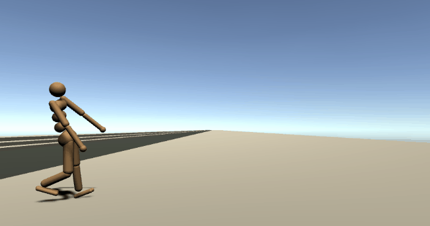

Marathon Man

This repository explores the application of deep reinforcement learning for physics-based animation.  It contains a set of high-dimensional continuous control benchmarks using Unity’s native physics simulator, PhysX. The environments can be trained using Unity ML-Agents or any OpenAI Gym compatible algorithm. This project may be useful for:

* Video Game researchers interested in apply bleeding-edge robotics research into the domain of locomotion and AI for video games.
* Academic researchers looking to leverage the strengths of Unity and ML-Agents along with the body of existing research and benchmarks provided by projects such as the [DeepMind Control Suite](https://github.com/deepmind/dm_control), or [OpenAI Mujoco](http://gym.openai.com/envs/#mujoco) environments.

The Unity project has two parts. Both can be find in *UnitySDK > Assets*: 

- In folder *MarathonEnvs* there are several benchmarks of physics-based animation, implemented on the basis of different papers in the field. More details on the environments can be found [here](./marathon-environments-intro.html) and instructions on how to train them [here](marathon-environments-training.md)

- In folder *MarathonController* there are  resources to take a skinned character, with a typical controller like mecanim or motion matching, and generate from it a training environment. Further details can be found  [here](marathon-controller-training.md)

- There are also instructions to export the outcome of the training [here](export-outcome.md)

### 1. Getting started
-  Check the [installation instructions](installation.md)
- Make sure you can train an existing environment.
- If you want to adapt it to your own characters, or explore the creation of novel controllers, we recommend you to start with the instructions in the  [here](marathon-controller-training.md)
- You can also follow the [2021 SIGGRAPH course on physics-based character animation](https://youtu.be/ok0VH9toTfk) based on this project.
 

If you have further questions, feel free to join our [Discord server](https://discord.gg/MPEbHPP) 

### 2. Contributors
v4.0 was created by:
* [Joe Booth (@Sohojoe)](https://github.com/Sohojoe), Twitter - [@iAmVidyaGamer](https://twitter.com/iAmVidyaGamer)
* [Joan Llobera](joanllobera.github.io/), at the [Artanim Foundation](www.artanim.ch)
* Valérie Juillard, a colleague from the [Artanim Foundation](www.artanim.ch) has provided some of the animations.

v3.0 was created by:
* [Joe Booth (@Sohojoe)](https://github.com/Sohojoe), Twitter - [@iAmVidyaGamer](https://twitter.com/iAmVidyaGamer)
* [Vladimir Ivanov (@vivanov879)](https://github.com/vivanov879)

*Note: This project is the result of contributions from members of the Unity community (see below) who actively maintain the repository. As such, the contents of this repository are not officially supported by Unity Technologies.*

###  3. Open issues

Currently, our main challenge is that results still look like if they came with this *department of silly walks* effect, (something that  obviously does not appear in the demos of the papers). It is annoying, and we absolutely need to solve it if we want to have something that can be used in practice. 

### 4. Publications

* SIGGRAPH 2021 Course based on the benchmarks in this repository (coming soon)
* Technical Paper (v3.0, 2020): [Realistic Physics Based Character Controller](https://arxiv.org/abs/2006.07508)
* AAAI 2019 Workshop on Games and Simulations for Artificial Intelligence: [Marathon Environments: Multi-Agent Continuous Control Benchmarks in a Modern Video Game Engine](https://arxiv.org/abs/1902.09097)
* An early version of this work was presented March 19th, 2018 at the AI Summit - [Game Developer Conference 2018](http://schedule.gdconf.com/session/beyond-bots-making-machine-learning-accessible-and-useful/856147)
* Legacy Tutorial: [Getting Started With MarathonEnvs](https://towardsdatascience.com/gettingstartedwithmarathonenvs-v0-5-0a-c1054a0b540c).This is a legacy tutorial from an older version of MarathonEnvs. 

### 5. Licensing

All the project is under Apache License Version 2.0, January 2004  http://www.apache.org/licenses/LICENSE-2.0 , with the single exception of the motion data for the quadruped is adapted under the available under the terms of the  [Attribution-NonCommercial 4.0 International](https://creativecommons.org/licenses/by-nc/4.0/legalcode) (CC BY-NC 4.0) license, as stated in their [README](https://github.com/sebastianstarke/AI4Animation), 

### 6. References

* [DReCon: data-driven responsive control of physics-based characters](https://dl.acm.org/doi/10.1145/3355089.3356536) Insperation for ControllerMarathonMan environment.
* [DeepMimic: Example-Guided Deep Reinforcement Learning of Physics-Based Character Skills](https://arxiv.org/abs/1804.02717) Insperation for Style Transfer environments.
* [OpenAI.Gym Mujoco](https://github.com/openai/gym/tree/master/gym/envs/mujoco) implementation. Good reference for enviroment setup, reward functions and termination functions.
* [PyBullet pybullet_envs](https://pybullet.org) - a bit harder than MuJoCo gym environments but with an open source simulator. Pre-trained environments in [stable-baselines zoo](https://github.com/araffin/rl-baselines-zoo).
* [DeepMind Control Suite](https://github.com/deepmind/dm_control) - Set of continuous control tasks.
* DeepMind paper [Emergence of Locomotion Behaviours in Rich Environments](https://arxiv.org/pdf/1707.02286) and [video](https://youtu.be/hx_bgoTF7bs)- see page 13 b.2 for detail of reward functions
* [MuJoCo](http://www.mujoco.org) homepage.
* A good primer on the differences between physics engines is ['Physics simulation engines have traditional made tradeoffs between performance’](https://homes.cs.washington.edu/~todorov/papers/ErezICRA15.pdf) and it’s accompanying [video](https://homes.cs.washington.edu/~todorov/media/ErezICRA15.mp4).
* [MuJoCo Unity Plugin](http://www.mujoco.org/book/unity.html) MuJoCo's Unity plugin which uses socket to comunicate between MuJoCo (for running the physics simulation and control) and Unity (for rendering).

**Document last updated: 11.05.2021**

