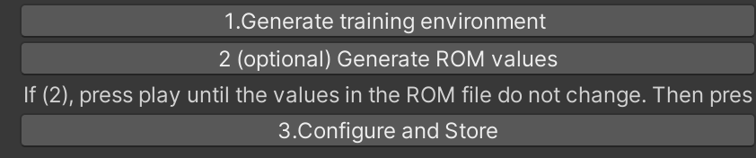
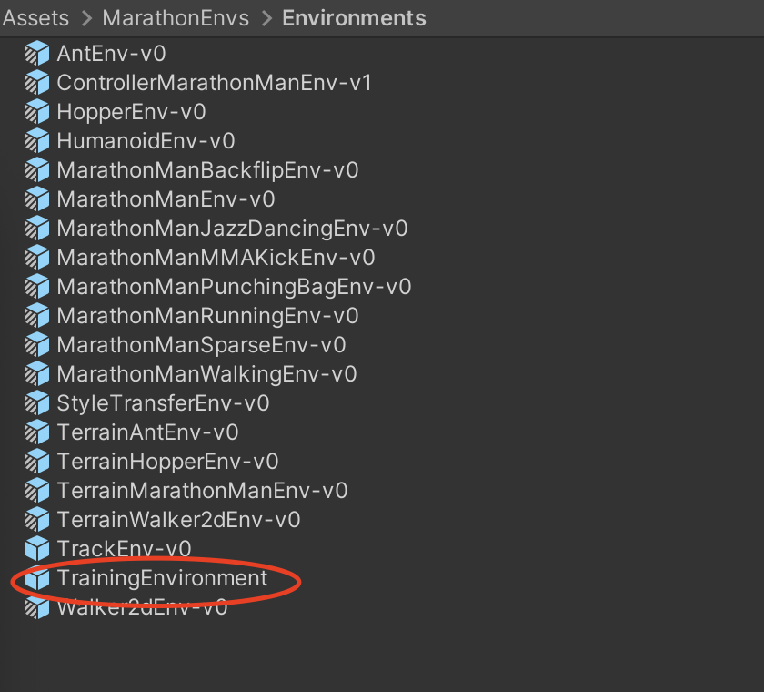
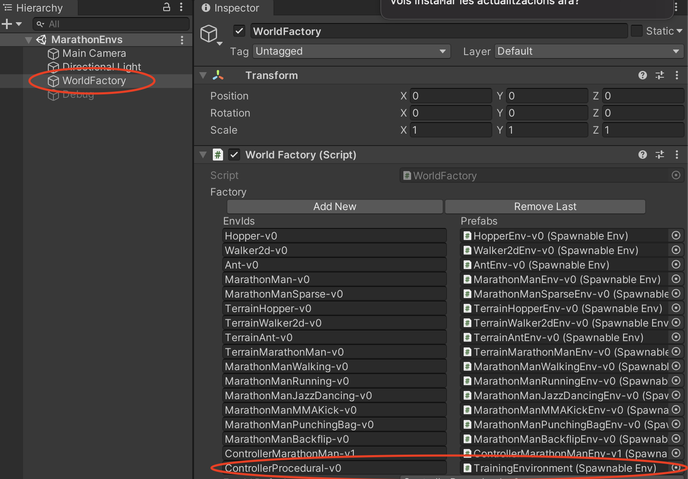

# Training with the Marathon Controller


Below we detail how to generate a training environment for your own character.

1. Section 1 explains how to train an existing environment

2. Section 2 explains how to create a new training environment with your own character

3. Section 3 explains the main steps needed to create your own character controller, including debugging tools

Once you are happy with the outcome of your training, there are  instructions to export the outcome of the training to your own project [here](export-outcome.md)


### 1 How to  train an existing physics character


1.Open Marathon Environments repository

2.Open the training scene

 If you want to see how it looks with the training provided, just click on the desired environment, otherwise: 

3. You can train in editor, to check everything goes well. An example instruction would be:

```shell
mlagents-learn config/marathon_envs_config.yaml --run-id=Test4MyFirstRun --env-args --spawn-env=ControllerProcedural-v0
```

4. To train with a **binary** file:

- Compile the project only with the scene MarathonEnvs


- Store it in the envs folder (if it is the first time, you will need to create it, at the same level than the config and UnitySDK folders)

5. Launch training 

Once compiled, simply launch the *marathonenvs* training environment with the following instruction: 

```shell
mlagents-learn config\marathon_envs_config.yaml 
 --env="envs\Marathon.exe" 
 --num-envs=25 --run-id=MyFirstRun --no-graphics 
 --env-args --spawn-env=DReCon-v0 --num-spawn-envs=20
```


Make sure that the `--spawn-env`variable is targeting the name that you associated with your procedural environment.


**Other examples and differences betweeen OS systems **


You can either make a binary containing only the *MarathonEnvs.unity* scene and run the instructions below, or do a quick training test in editor. Below are examples on the syntax needed to train for different OS

macOS format (probably also Linux):

```
mlagents-learn config/marathon_envs_config.yaml --env="envs/MarathonEnvs" --num-envs=10 --run-id=Hopper-001 --no-graphics --env-args --spawn-env=Hopper-v0 --num-spawn-envs=50
```

Windows format:

```
mlagents-learn config\marathon_envs_config.yaml --env="envs\MarathonEnvs\Marathon Environments.exe" --num-envs=25 --run-id=newMlAgents-007 --no-graphics --env-args --spawn-env=ControllerMarathonMan-v1 --num-spawn-envs=35
```

Example to test quickly in editor (in windows:

```
mlagents-learn config\marathon_envs_config.yaml --run-id=test-2020-01-06-v2 --env-args --spawn-env=ControllerMarathonMan-v1 
```


### 2 How to create a new physics character

To simplify the creation of a training environment, you can do it directly from a character with an animation controller associated to it. The main steps are as follows:

1.Import the character and the animations

2.Create the animation controller (Mecanim or Motion Matching)

3.Create the training environment and set the degrees of freedom (automatic)

4.Adjust the ragdoll features (size of colliders, weights)

Launch training (see previous steps)


To do so, in more detail:

1. Open the scene found in `Assets > ProceduralGeneration > 2.GenerateTrainingEnvFromAnimatedCharacter.unity`


2. Add the animated character that you prefer

It needs to be a character that moves, either interactively, either as a long sequence. For results to work reasonably, there needs to be some variety of movements, otherwise the range of motion will be too narrow, and the training will give poor results.

If you want to, you can play with **Available controllers:** There is also a called *AnimationControllers* that contains 3 examples of those:

- In *Walk-Run-Jump* there is an example of a humanoid performing different navigation, animated with Mecanim
- In *Procedural-from-FBX* there is an example of a humanoid animated extracting the animation from a video
- In *Quadruped* there is an example of a dog running around. The animations of this dog have been created by Valérie Juillard, adapting adapted from [mocap data provided by Sebastian Starke](https://github.com/sebastianstarke/AI4Animation#siggraph-2018mode-adaptive-neural-networks-for-quadruped-motion-controlhe-zhangsebastian-starketaku-komurajun-saitoacm-trans-graph-37-4-article-145joint-first-authors). 


As an extra test for the procedural generation, we have managed to train  with Motion Matching as a controller but, since we are using [a proprietary implementation](https://assetstore.unity.com/packages/tools/animation/motion-matching-for-unity-145624), it is not included here. 


3. Select the gameObject *CHECKME-generate-training-env*. That gameObject has  the component *Training Environment Generator*. 


1. You should drag in the first 3 fields  the character that you want to use, as well as it's head, and it's root. Below you can find an example with a character consisting of a very long animation:


4. At the bottom of the *Training Environment Generator* you can find the 3 steps that you need to go through:



Once you have gone through these 3 steps, you will have an environment generated. It will be in *Assets > MarathonEnvs > Environments* and, if it the first one, will be called *TrainingEnvironment*.



If one already exists, it will store it with a name like *TrainingEnvironment 1*, and add indices (2,3,...).


**Warning:** The environment generated has everything needed to start training, but it is not adjusted well enough to immediately get good results from the training. An aspect that is well defined from data available, and will work well, is  the use of the range of motion of a long animation to determine the rotation constraints at each joint and the degrees of freedom of the overall motion. However, the size of the body colliders and the weight of each is not well adjusted when created procedurally, and the resulting prefab will need tweaking. Getting this to work with Quadrupeds is neither explored in detail.


5. Open the scene *Assets > MarathonEnvs > Scenes > MarathonEnvs*. When you select the gameObject *WorldFactory*, you will see a list of environments. Click on Add New, give it a name (in the example below I called it *ControllerProcedural-v0*), and add the Procedural Environment that was stored. If you do so, it should look like below



6. You can now train using the usual procedure, like described previously

   

### 3 Generate a new physics controller

To design a new reward and a new configuration for your own physics-based controller, there are several aspects to consider. The main steps are:

- Designing a Reward
-  Adjust the Physical Environment (particularly the motor actions)
-  Adjust the Training Scenario (particularly the early termination criteria)

This is explained in detail in the SIGGRAPH 21 course “*New Techniques for Interactive Character Animation*” course that can be found [here](https://s2021.siggraph.org/presentation/?id=gensub_385&sess=sess182). 


In addition, when designing the physical environment, it is advisable to use debug tools available to check how the designed motor system works. In particular, in the training scene there is a Debug object. If you enable it, it is possible to see how the ragdoll motors behave separately from the training.

The main debug options to consider are:


1. **Freeze the hips**

   This prevents the character from falling. It allows checking whether the default pose  for the articulations is good (see below). 


It also allows exploring how to customize the range of motion boundaries, and different parameters of the actuators of each motor (in Unity, these are **ArticulationBody ** elements, see below)


2. **Apply Specific actions**

When the debug option is activated, each *ArticulationBody* has one DebugMotor script added to it procedurally. This allows applying actions to the different degrees of freedom of each joint to validate whether the forces applied make sense.


3. **Apply random actions**

The general idea is that when we apply random actions the character should not move weirldy (like a controller that is unstable), and ideally do not appear to be too stiff or too lose. This should work both with T pose and without it (with the character on the floor).
