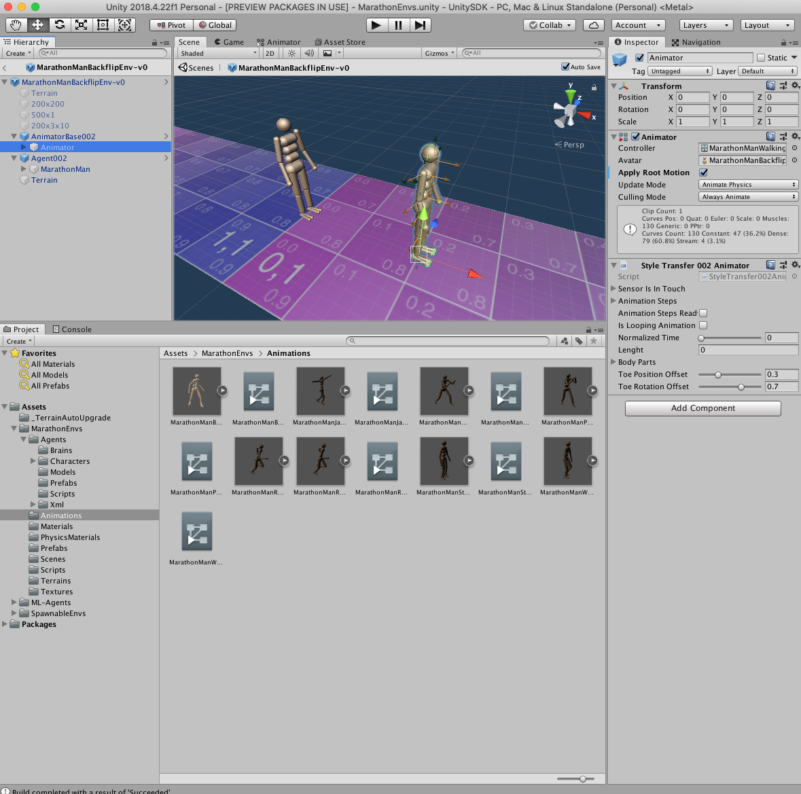
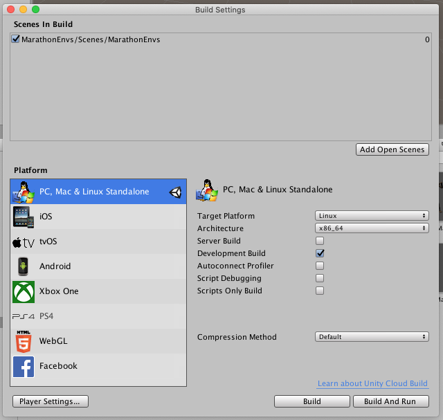
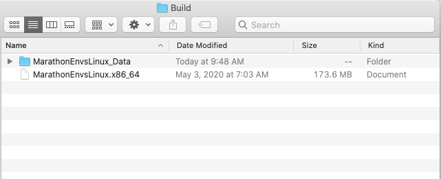
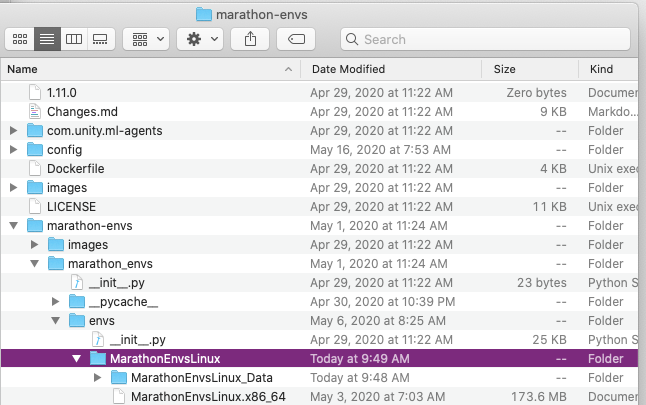
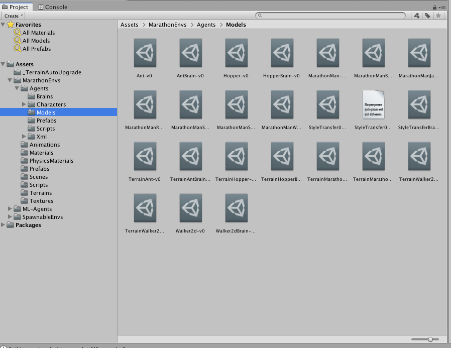

# Training the marathon environments


### Note for MacOS & Linux

* You will need to replace the path `\` with `/`
* On MacOS
  * Replace `"envs\MarathonEnvs\Marathon Environment.exe"` with `"envs/MarathonEnvs"`
* On Linux
  * Replace `"envs\MarathonEnvs\Marathon Environment.exe"` with `"envs/MarathonEnvs/Marathon Environment.x86_64"`

### Windows

#### Hopper-v0

``` shell
mlagents-learn config\marathon_envs_config.yaml --train --env="envs\MarathonEnvs\Marathon Environment.exe" --num-envs=10 --run-id=Hopper-001 --env-args --spawn-env=Hopper-v0 --num-spawn-envs=10
```

#### Walker2d-v0

``` shell
mlagents-learn config\marathon_envs_config.yaml --train --env="envs\MarathonEnvs\Marathon Environment.exe" --num-envs=10 --run-id=Walker2d-001 --env-args --spawn-env=Walker2d-v0 --num-spawn-envs=10
```

#### Ant-v0

``` shell
mlagents-learn config\marathon_envs_config.yaml --train --env="envs\MarathonEnvs\Marathon Environment.exe" --num-envs=10 --run-id=Ant-001 --env-args --spawn-env=Ant-v0 --num-spawn-envs=10
```

#### MarathonMan-v0

``` shell
mlagents-learn config\marathon_envs_config.yaml --train --env="envs\MarathonEnvs\Marathon Environment.exe" --num-envs=10 --run-id=MarathonMan-001 --env-args --spawn-env=MarathonMan-v0 --num-spawn-envs=10
```

#### MarathonManSparse-v0

``` shell
mlagents-learn config\marathon_envs_config.yaml --train --env="envs\MarathonEnvs\Marathon Environment.exe" --num-envs=10 --run-id=MarathonManSparse-001 --env-args --spawn-env=MarathonManSparse-v0 --num-spawn-envs=10
```

#### TerrainHopper-v0

``` shell
mlagents-learn config\marathon_envs_config.yaml --train --env="envs\MarathonEnvs\Marathon Environments.exe" --no-graphics --num-envs=10 --run-id=TerrainHopper-000 --env-args --spawn-env=TerrainHopper-v0 --num-spawn-envs=100
```

#### TerrainWalker2d-v0

``` shell
mlagents-learn config\marathon_envs_config.yaml --train --env="envs\MarathonEnvs\Marathon Environments.exe" --no-graphics --num-envs=10 --run-id=TerrainWalker2d-001 --env-args --spawn-env=TerrainWalker2d-v0 --num-spawn-envs=100
```

#### TerrainAnt-v0

``` shell
mlagents-learn config\marathon_envs_config.yaml --train --env="envs\MarathonEnvs\Marathon Environments.exe" --no-graphics --num-envs=10 --run-id=TerrainAnt-001 --env-args --spawn-env=TerrainAnt-v0 --num-spawn-envs=100
```

#### TerrainMarathonMan-v0

``` shell
mlagents-learn config\marathon_envs_config.yaml --train --env="envs\MarathonEnvs\Marathon Environments.exe" --no-graphics --num-envs=10 --run-id=TerrainMarathonMan-001 --env-args --spawn-env=TerrainMarathonMan-v0 --num-spawn-envs=100
```


#### MarathonManBackflip-v0

``` shell
mlagents-learn config\marathon_envs_config.yaml --train --env="envs\MarathonEnvs\Marathon Environment.exe" --num-envs=10 --no-graphics --run-id=MarathonManBackflip-001 --env-args --spawn-env=MarathonManBackflip-v0 --num-spawn-envs=10
```


----


## Working with Style Transfer  

#### Introduction
There are several steps to update the style transfer environment. This sections gives an overview of the 
steps required to update, build, and train your own environment on a server. 

#### Update style transfer target animation
In order to switch from imitatin a Backflip animation, to, say Kick animation, you need to 
first open the UnitySDK/ package. Then, in the Unity editor, double click the 
`Assets/MarathonEnvs/Agents/Prefabs/MarathonBackflipEnv-v0` prefab. Select the `AnimatorBase/Animator`
gameObject in the editor, and drag the desired animation onto Animator Controller: 


#### Build the new environment
Now you can make the changes to the scripts that work with style transfer. Mainly, these are 
`StyleTransfer002Master.csv`, `StyleTransfer002Animator.csv`, and `StyleTransfer002Agent.csv`. Then, in the 
Unity Editor, click `File->BuildSettings`. In order to build on linux system, make these selections:


Then, copy over the Build to your linux server. You need these files: 


Put these files into the directory on your server:


#### Start the training
Now, you can run the shell command on your server in order to start training: 
``` bash
mlagents-learn config/marathon_envs_config.yaml --train --env marathon-envs/marathon_envs/envs/MarathonEnvsLinux/MarathonEnvsLinux.x86_64 --num-envs=7 --run-id=MarathonManBackflip123 --load --no-graphics --env-args --spawn-env=MarathonManBackflip-v0 --num-spawn-envs=100
```
Run tensorboard and watch the training process: 
``` bash
tensorboard --logdir results --port 6006
```

#### Deploy the trained model
Once happy with the model training progress, you can see it in action. Copy over the trained model found
on the server at `models/MarathonManBackflip123/MarathonManBackflip-v0.nn` into your Unity Editor 
`MarathonEnvs/Agents/Models` window:

Now, activate `Scenes/MarathonEnvs' scene, click Play, and select the `BackflipEnvironment`. Your trained
model agent will be shown in action. 

#### Training hints
The animations provided with the repo are trainable within a reasonable timeframe from several hours to 
a day. The reward function works equally well for all of them. However, you must adjust the stopping 
conditions for each animation by changing the reward threshold in the `StyleTransfer002Agent.cs`:
  ``` 
		if (reward < 0.5)
			Done();
  ```
For example, if you set threshold too high for the running animation, the agent will be reset too soon, 
before it had a chance to accelerate. Setting the threshold too low, however, will result in the agent
running on its knees. Check out the [video results](https://www.youtube.com/playlist?list=PLX7INEUkOHp-uXg6xhqDWuDT4ENb6sSWA) 
showing the target animations along with the agents. Each video file describes the length of training
and the reward threshold. For example, 
`Backflip05Reward8h.mov` says that an agent was trained on `Backfilp` animation for `8 hours` with a 
`reward threshold of 0.5`.
